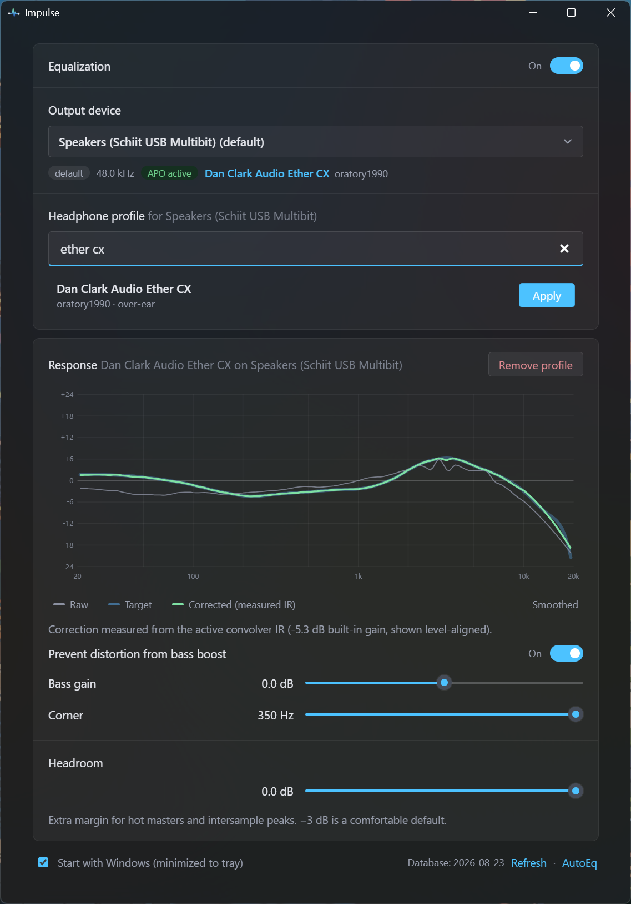

# Impulse

AutoEq for your Windows system audio — a Wavelet-style frontend. Pick your headphones, hit
Apply. No config editing.



## How it works

Impulse requires [Equalizer APO](https://sourceforge.net/projects/equalizerapo/) and drives it
by writing config files; all audio processing is Equalizer APO's. Installing and enabling it on
a playback device is a prerequisite (the Impulse installer offers to fetch it).

Impulse manages its own file at `<EqualizerAPO>\config\Impulse\Impulse.txt`, pulled in via a
single `Include:` line appended to `config.txt`. An existing Equalizer APO / Peace setup is
left untouched.

Per device, Impulse writes a `Device:`-scoped section applying AutoEq's minimum-phase impulse
response with `Convolution:`, plus an optional post-convolver bass shelf and a pre-gain
assembled from the headroom setting and automatic shelf compensation.

Impulse is convolution-only. Equalizer APO requires the impulse response to match the
device's mix rate exactly, and AutoEq publishes 44.1 and 48 kHz IRs — at any other rate the
device is left unprocessed and the app tells you why.

Headphone data comes from the AutoEq results database (~6,000 models across oratory1990,
crinacle, Rtings and more), indexed via `results/INDEX.md` in one request and cached locally
for a week.

## Features

- Search across the full AutoEq database (~6,000 profiles), best measurement source
  ranked first, alternative sources one click away
- Per-device profiles — assignments follow the endpoint GUID and survive unplug/replug
- Response chart with raw / target / corrected curves — the correction is **measured from the
  actual convolver IR on disk**, not the published curve; smoothed and per-series toggles
- Bass shelf (post-convolver) with automatic pre-gain compensation so boosts can never clip
- Custom convolver WAVs — bring your own impulse response (44.1/48 kHz, matched to the
  device's mix rate); it gets the same measured-response chart, bass shelf, and gain handling
- Native Windows 11 look: Mica backdrop (solid fallback pre-Win11 or with transparency
  effects disabled), Fluent controls, system accent color, light/dark theme
- Master EQ on/off from the window or the system tray; close-to-tray; start-with-Windows
- Self-healing: a wiped Equalizer APO config is restored automatically on launch
- Auto-updates from GitHub Releases (signed, via the Tauri updater)

The app is Windows-only by design.

## Development

Prerequisites: Rust (MSVC toolchain), Node.js, pnpm. On Windows 11, Smart App Control must be
off — it blocks the unsigned build scripts cargo compiles and runs, with no exclusion
mechanism.

```sh
pnpm install
git config core.hooksPath .githooks   # one-time: enable the pre-commit hook
pnpm tauri dev    # run the app with hot reload
pnpm tauri build  # produce the NSIS installer + updater artifacts
pnpm run check    # svelte-check / TypeScript
pnpm run lint     # oxlint
pnpm run format   # oxfmt (tabs, double quotes; .svelte files not covered)
```

The pre-commit hook runs oxlint, `oxfmt --check`, and `cargo fmt --check`.

Stack: Tauri v2 (Rust) + SvelteKit (Svelte 5, static adapter, SPA mode) + TypeScript.

| Area | Where |
| --- | --- |
| Audio endpoint enumeration (WASAPI) | `src-tauri/src/devices.rs` |
| Equalizer APO detection & config generation | `src-tauri/src/eapo.rs` |
| AutoEq index & profile downloads | `src-tauri/src/autoeq.rs` |
| Persisted state (`%APPDATA%`) | `src-tauri/src/state.rs` |
| Commands, tray, updater, IR analysis | `src-tauri/src/lib.rs` |
| UI | `src/routes/+page.svelte`, `src/lib/Curve.svelte`, `src/lib/api.ts` |
| Installer hook (Equalizer APO bootstrap) | `src-tauri/windows/hooks.nsh` |
| Release workflow (tag → signed installer + `latest.json`) | `.github/workflows/release.yml` |

### Releasing

1. Add the repo secret `TAURI_SIGNING_PRIVATE_KEY` (contents of the private key generated with
   `pnpm tauri signer generate`; the public key lives in `tauri.conf.json`).
2. Bump the version in `src-tauri/tauri.conf.json`, `src-tauri/Cargo.toml`, and
   `package.json` (keep them aligned), commit, and push a `v*` tag.
3. The workflow builds the NSIS installer, signs the updater artifact, and publishes a GitHub
   Release with `latest.json`. Running apps pick the update up on next launch.

## Roadmap

- Standalone convolution engine (virtual audio device + WASAPI) to drop the Equalizer APO
  dependency entirely
- Correction strength slider (requires generating minimum-phase FIRs locally)
